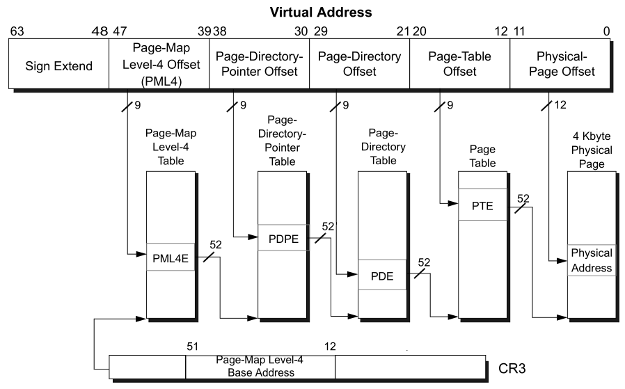

##Paging

Преобразует логические адреса в физические, используя *paging*. Таблицы страниц имеют формат 64 битного ражима x86. При этом в записях таблиц игонорируются все поля, кроме полей адреса(`PhysicalAddress`) и флага присутствия(`P`).

	