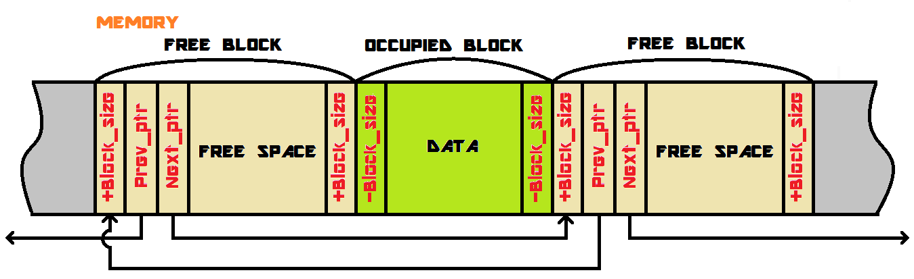

## Аллокатор

Простой аллокатор, основанный на методе граничных маркеров. Память представлена в виде блоков, на обеих границах которых хранится размер блока (`+-Block_size`). Знак определяет то, занят блок или свободен ("`+`" — свободен, "`-`" — занят). Свободные блоки соединены в двусвязный список. При аллокации памяти ищется первый свободный блок достаточного размера, извлекается из списка и используется для создания занятого блока. Если найденный блок имеет слишком большой размер, то он разделяется на два, первый из которых является занятым, а второй — новым свободным блоком (далее новый блок добавляется в список свободных блоков). При освобождении занятого блока, он преобразуется в свободный и добавляется в список. В случае, если он граничит с уже свободными блоками, блоки объединяются в один свободный.

	
